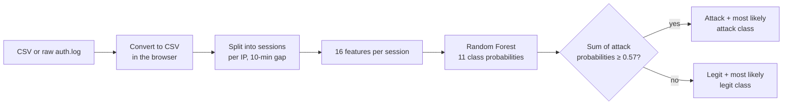

# SSH Brute-Force Detector

**Upload an SSH log and see, for every session, whether it is an attack — and *which kind*:** burst, botnet, password spraying, credential stuffing… One Random Forest, 11 classes, mapped to MITRE ATT&CK. It runs entirely in the browser, or behind a FastAPI backend.

[**Live demo**](https://sshml-frontend.onrender.com) · [Web app details](web/README.md) · [Deployment notes](DEPLOY.md) · [Training notebook](v3/ssh_multiclass_pipeline.ipynb)

> The demo's backend is on Render's free tier: it sleeps after 15 minutes idle, so the first request can take about a minute. The page can also run the model fully client-side (see [Run it locally](#run-it-locally)).

## Why this project

A rule like "more than N failed logins" is noisy and easy to evade: a user who mistypes a password looks like an attack, while a patient botnet that sends one guess every few minutes looks like nothing. This project asks whether a model can tell **legitimate behaviour from attack behaviour using only what is in the log**, and name the attack type, the way an analyst would triage it.

## What it does

- **Upload a log** as CSV, or as a raw OpenSSH `auth.log` / `journalctl` export (converted to CSV in the browser).
- **Per session**, shows a risk score, the behaviour label (e.g. *Password spraying · T1110.003*), and how confident the model is. Low-confidence calls are shown as "not sure" instead of being forced into a class.
- **Generates fresh test logs in the page**: pick any of the 11 behaviours and a count; IPs, times and counts come from a seeded generator that never reuses the demo logs' IPs. The page keeps the answer key to itself and grades the model per class after it has answered.
- **10 demo logs** (4 legitimate, 6 attacks) and a **Live Attack Console** where you type password guesses (or play a preset) and watch the score change after every attempt.

## The 11 classes

| Group | Class | Signal the model looks for | MITRE ATT&CK |
|---|---|---|---|
| Legit | `legit_login` | succeeds right away, no failures | – |
| Legit | `legit_typo` | a few failures at human typing speed, usually ends in success | – |
| Legit | `shared_ip_legit` | many usernames from one IP (office/NAT), almost all succeed | – |
| Attack | `burst_bruteforce` | many failures in a short time | T1110.001 |
| Attack | `focused_bruteforce` | repeated failures against one account, slower than a burst | T1110.001 |
| Attack | `large_dictionary_scanner` | very many usernames, most of them not on the system | T1110.001 |
| Attack | `low_and_slow` | attempts spaced far apart, spread over many sessions | T1110.001 |
| Attack | `persistent_multiday_attacker` | the same IP keeps coming back over several days | T1110.001 |
| Attack | `coordinated_botnet_spike` | other IPs hit the same account within 15 minutes | T1110 |
| Attack | `password_spray` | a few attempts per account across many accounts | T1110.003 |
| Attack | `credential_stuffing` | one attempt per account, some of them succeed | T1110.004 |

## How it works



**16 features**, in five groups:

| Group | Features |
|---|---|
| Outcome | `fail_ratio`, `n_failed`, `n_success`, `invalid_ratio`, `publickey_ratio`, `ends_after_success` |
| Targeting | `n_unique_usernames`, `targets_default_username` |
| Timing | `duration_seconds`, `std_inter_arrival_s`, `attempts_per_minute` |
| IP history (within the uploaded file) | `ip_session_count`, `ip_active_span_days`, `ip_sessions_per_day`, `ip_total_events` |
| Cross-IP | `distinct_ips_same_target_15min` |

**Decision rule.** `risk` is the sum of the 8 attack-class probabilities. If `risk ≥ 0.57` the session is an attack, labelled with its most likely attack class; otherwise it is legitimate, labelled with its most likely legit class. The 0.57 threshold comes from 5-fold cross-validation on the training split only.

## Results

All numbers are on **synthetic data** from the generator in `v3/` (train/test split 75/25, stratified by pattern; the out-of-distribution set uses a different seed, shifted parameter ranges and a 45-day span).

| | Test (979 sessions) | Out-of-distribution (3,316 sessions) |
|---|---|---|
| Attack vs legit: F1 | 0.984 | 0.985 |
| Precision / false positives | 1.00 / 0 | 1.00 / 0 |
| Recall | 0.969 | 0.970 |
| ROC-AUC / PR-AUC | 0.993 / 0.996 | 0.992 / 0.995 |
| 11-class macro-F1 | 0.991 | 0.992 |

Sanity check: with shuffled labels the 11-class macro-F1 drops to 0.045, so the score is not an artefact of the pipeline.

The weakest classes are `focused_bruteforce` (F1 0.91 test / 0.95 OOD) and `legit_typo` (0.99): a short brute force against one account genuinely resembles someone mistyping a password.

**What the recall number hides.** Most of the missed attacks are `ambiguous_attack` sessions, attacks the generator deliberately shapes to look exactly like a mistyping user (16 in test, 55 in OOD). They are not one of the model's classes and are detected 0% of the time. That is reported, not tuned away.

### A first look at real traffic

I also ran a public 2,000-line OpenSSH log ([Loghub](https://github.com/logpai/loghub), `OpenSSH_2k.log`) through the converter and the model: 532 login events → 33 sessions, 15 flagged as attacks (503 of the 532 events). There are no labels, so this is **not scored**. By inspection, none of the flagged IPs ever logged in successfully, and of the 12 IPs with five or more attempts and no success, 9 were flagged. The three misses were two 6-attempt bursts against `root` and a scanner sending one probe about every 48 minutes, which matches the blind spots below.

## Engineering notes

- **No peeking at the test set.** Hyperparameters and the decision threshold are chosen by cross-validation on the training split only.
- **Train/serve parity.** The same decision rule exists in three places (`v3/train_multiclass_model.py`, `backend/pipeline.py`, `web/js/model.js`) and the in-browser forest walker compares thresholds in float32 like scikit-learn does. Browser and backend agree on 2,905 sessions with 0 label differences (max risk difference 3e-8).
- **Classes the data can't separate are merged,** not faked: roaming users are folded into `legit_login` and ambiguous legit users into `legit_typo`, because the generator makes them indistinguishable.
- **Same session gap in training and serving** (10 minutes), since several features depend on how sessions are cut.
- **Logs are attacker-controlled input.** Usernames from a log are rendered HTML-escaped, and timestamps are parsed strictly (zone-qualified, so daylight-saving changes cannot reorder events).

## Limitations

- Trained on synthetic data only; results above are **not** evidence of real-world accuracy.
- Known blind spots: attacks shaped like a mistyping user (`ambiguous_attack`), focused brute force with few attempts against a real-looking account, and attacks with perfectly regular timing.
- IP-history and cross-IP features only see the uploaded file, so short files carry less context. A production system would need a persistent store keyed by IP and username.
- Roaming users (one user, several IPs) are labelled as normal logins; naming them separately would need a user-level feature.
- This is batch analysis of a log file, not a streaming IDS, and it does not block anything.

## Run it locally

**Frontend only** (the model runs in the browser; Chrome and Edge block `fetch()` from `file://`, so serve it):

```bash
cd web
python -m http.server 8000        # or double-click run.bat on Windows
# open http://localhost:8000
```

`web/config.js` decides where the model runs: an empty `API_BASE_URL` means in the browser; a URL means the CSV is sent to that backend.

**Backend** (FastAPI):

```bash
cd backend
pip install -r requirements.txt   # pinned versions; developed on Python 3.11
uvicorn main:app --port 8001
# set API_BASE_URL to "http://localhost:8001" in web/config.js
# endpoints: GET /health, POST /predict?gap_minutes=10  (multipart "file")
```

**Retrain** (from the repository root; rewrites the model files and the evaluation JSON):

```bash
python v3/train_multiclass_model.py
```

It reads `v3/ssh_features_v3.csv` and `v3/ssh_features_v3_ood.csv`, then writes `backend/ssh_bruteforce_multiclass.joblib`, `web/model/forest.json` and `v3/multiclass_model_eval.json`. Always deploy the two model files from the same run.

**Regenerate the data** (optional):

```bash
cd v3
python generate_v3_dataset.py
python extract_features_v3.py ssh_dataset_v3.csv ssh_features_v3.csv
python extract_features_v3.py ssh_dataset_v3_ood.csv ssh_features_v3_ood.csv
```

The raw datasets regenerate byte-for-byte. Feature extraction can differ in a handful of rows (5 of 3,913 sessions when I tried): when two usernames tie for "most used in a session", the pick depends on the pandas version. The committed feature files are the ones the model was trained on.

## Repository layout

```
web/                    static frontend: plain HTML/CSS/JS, no build step
  js/                     parsing, features, in-browser Random Forest, auth.log converter,
                          log generator, live console
  model/forest.json       the trained forest exported for in-browser inference
  test_logs/              10 demo logs
backend/                FastAPI inference service + model bundle
v3/                     data, features and training (folder named after the dataset version)
  generate_v3_dataset.py    synthetic log generator (14 behaviours, train + OOD sets)
  extract_features_v3.py    log → session features
  train_multiclass_model.py trains and exports the model, writes the evaluation
  ssh_multiclass_pipeline.ipynb   main write-up: model selection, threshold, results, limits
  ssh_bruteforce_pipeline_v3_executed.ipynb, verify_features_v3.py, verify_*.csv
                            feature analysis (correlation, VIF, mutual information,
                            permutation importance) from the earlier binary-model stage
  retrain_rf.py, ssh_bruteforce_model_v3.joblib
                            the earlier binary model and its training script; the notebook compares against it
render.yaml, DEPLOY.md  Render blueprint (backend + static frontend) and notes
```

## Tech stack

Python 3.11 · scikit-learn (Random Forest) · pandas / NumPy · FastAPI + Uvicorn · vanilla JavaScript (no framework) · Render

## Credits

- MITRE ATT&CK: [T1110 Brute Force](https://attack.mitre.org/techniques/T1110/) and its sub-techniques `.001` (password guessing), `.003` (password spraying), `.004` (credential stuffing).
- Real-log check: He et al., *Loghub: A Large Collection of System Log Datasets towards Automated Log Analytics* ([logpai/loghub](https://github.com/logpai/loghub)).

Student project by JJ ([@JJ-eiei](https://github.com/JJ-eiei)).
